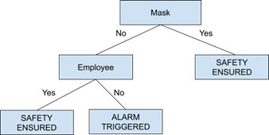

# Identification-of-Unmasked-Faces-COVID

COVID-19 has been around for more than a year and a half, and it seems like it won't stop anytime soon, with scientists prediciting a third wave hitting the world soon. One important factor for COVID prevention is Face Masks. This repository has scripts to identify masked and unmasked faces using Machine Learning. 

The central concepts used in the project is as
follows:
  1. Face Detection
  2. Supervised Learning
  3. Deep Neural Network
  4. Face Recognition

### Data Set 

The dataset is modifiable, and new folders can be added easily using an option in `project.py`.

The existing dataset looks like this:

**Combo**, **Employees**, **Mask Module** 

| Label | # of Images | Label | # of Images | Label | # of Images | 
| ----- |------------ | ----- |------------ | ----- |------------ |
| atharv-sinha | 102 | atharv-sinha | 136 | mask | 690 |
| bill-gates | 111 | bill-gates | 147 | nomask | 686 | 
| donald-trump | 108 | donald-trump | 144 |
| elon-musk | 111 | elon-musk | 147 |
| jack-ma | 98 | jack-ma | 134 |
| mask | 450 | narendra-modi | 142 |
| narendra-modi | 108 | unknown | 141 |
| unknown | 445 |

The validation dataset looks like this:

**Combo, Mask Module**
| Label | # of Images | Label | # of Images | 
| ----- |------------ | ----- |------------ | 
| atharv-sinha | 34 | mask | 239 |
| bill-gates | 37 | no-mask | 241 |
| donald-trump | 36 | 
| elon-musk | 36 | 
| jack-ma | 36 | 
| mask | 239 | 
| narendra-modi | 
| unknown | 241 |

You can access the database and validation data from the following Google Drive Link: https://drive.google.com/drive/folders/1GiemUX1UKkM7xxZfDiynqTZ8-427CPZA

### Execution

The `project.py` file can be run to perform various operations.
The present modules in the project are:
- Database Building Module : Can add more items in the database
- Mask Detection : Identification of Masked or Unmasked Faces
- Face Recognition : Recognition of Faces present in the database 
- AutoMode : A combination of mask module and face recog module. Check below image for working of Automode.

**Decision Tree for Automode**

## Validation Results

Confusion Matrix for the masked module:

|            | Mask | No Mask |
| ---------- | ---- | ------- | 
| Mask | 97.358 | 2.641 |
| No Mask |  7.345 | 92.655 |

Confusion Matrix for AutoMode module:
| | atharv-sinha | bill-gates | donald-trump | narendra-modi | jack-ma | mask | elon-musk | unknown |
| --- | --- |--- |--- |--- |--- |--- |--- |--- |
|atharv-sinha | 75.342 |1.9 | 0 | 0 | 0 | 0 |0 | 22.7 |
| bill-gates | 0 | 83.7379 | 3.5 | 4.31 | 3.372 | 0 | 3.341 | 1.7 |
| donald-trump | 0 | 1.334 | 85.759 | 9.792 | 0 | 0 |  0 | 3.11 |
| narendra-modi | 1.7 | 0 | 0 | 72.35 | 12.66 | 0 | 0 | 13.22 |
| jack-ma | 0 | 4.5 | 0 | 0 | 76.8 | 0 | 4.5 | 14.083 |
| mask | 0 | 0 | 0 | 0 | 0 | 97.34 | 0 | 2.66 |
| elon-musk | 0 | 1.84 | 0 | 0 | 12.154 | 0 | 70.234 | 15.8 |
| unknown | 0.8 | 2.67 | 2.42 | 1.542 | 11.345 | 0 | 1.852 | 79.833 |

